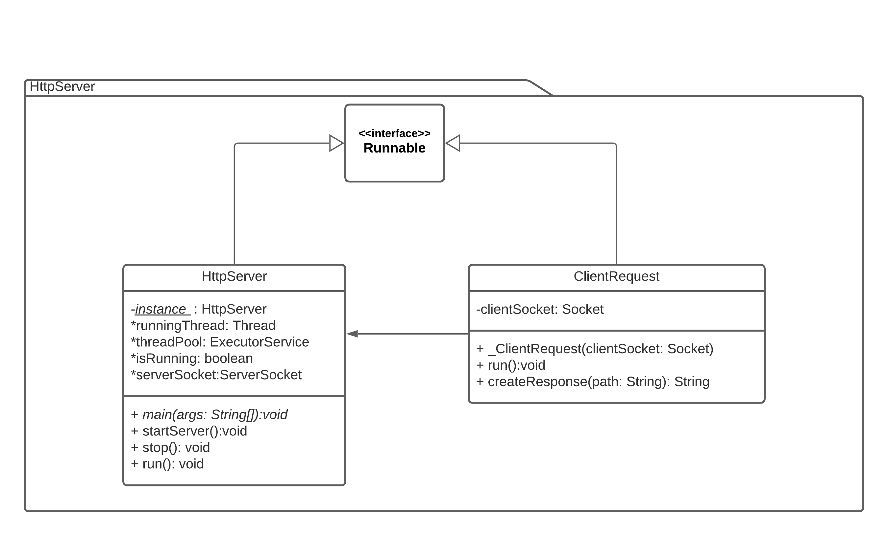
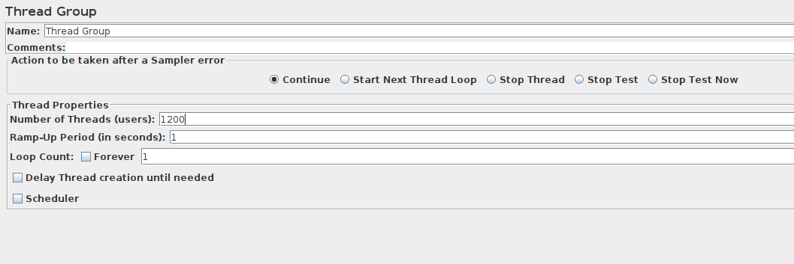
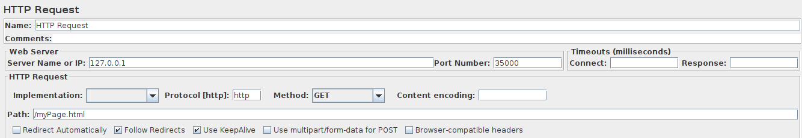
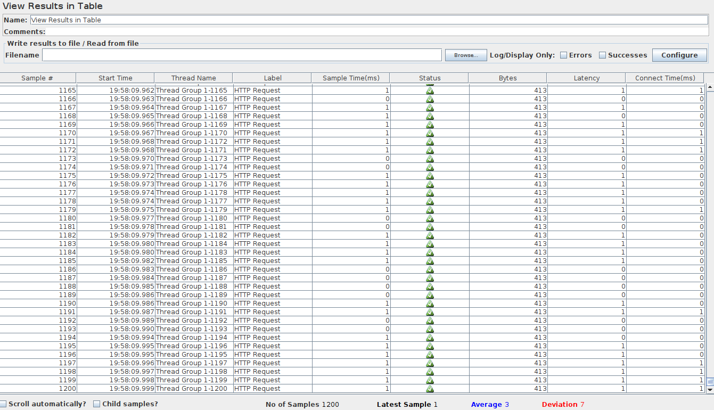
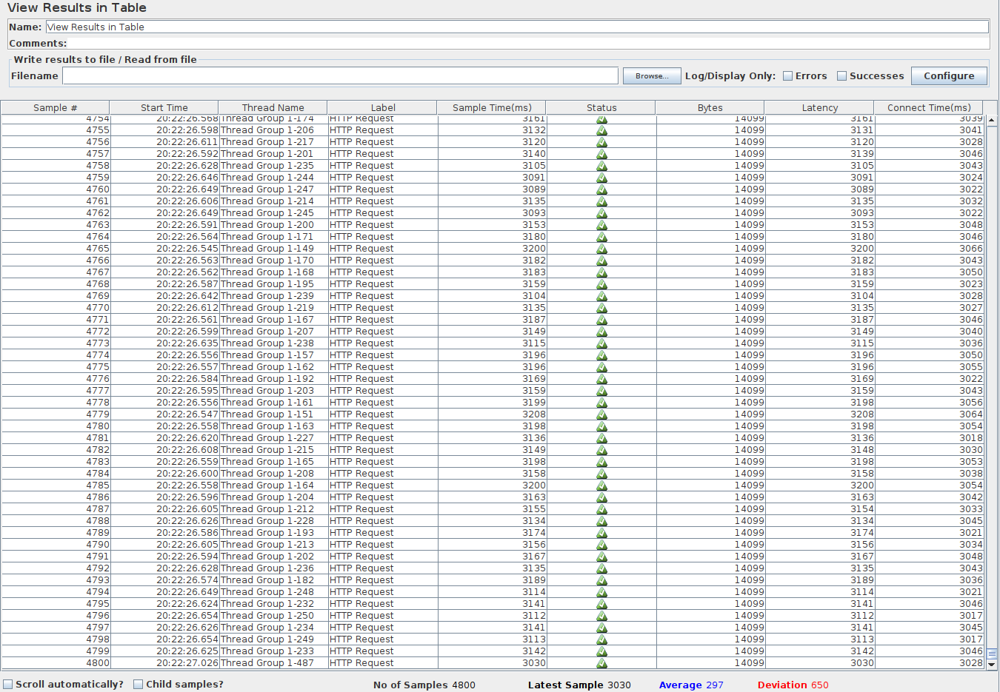
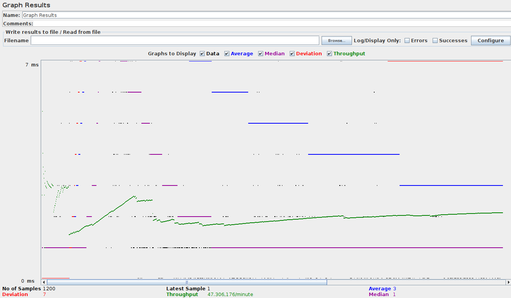
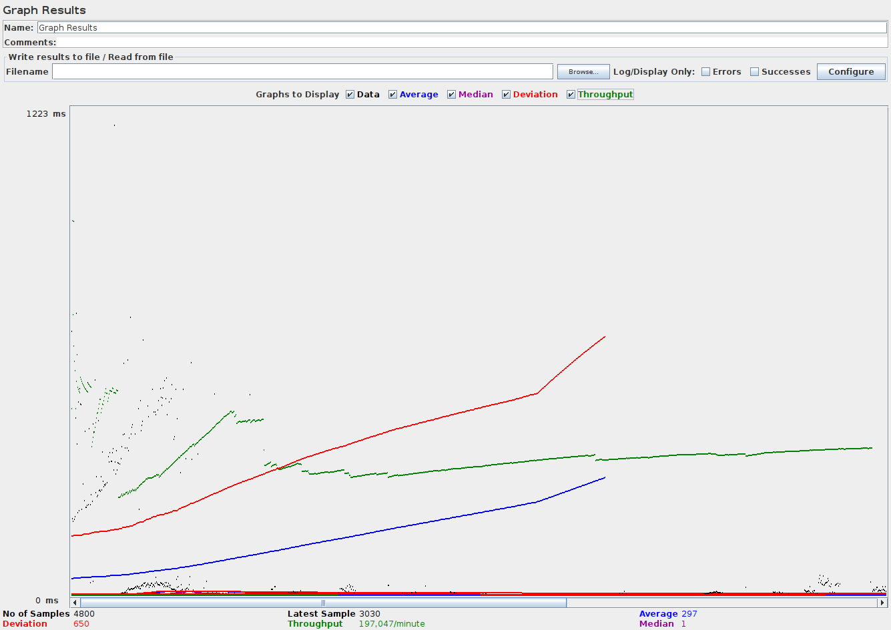

# Heroku Concurrent HTTP WebServer

Taller en donde se creará un servidor web HTTP que sea capaz de resolver una cantidad de peticiones de manera concurrente mediante el uso de un pool de hilos.

## Instrucciones de Uso

### Prerrequisitos
* git version 2.25.1
* Apache Maven versión: 4.0.0
* java versión: "1.8.0"
* Jmeter: 2.13

### Ejecución
Para poder usar el proyecto lo primero que se debe realizar es clonar el proyecto utilizando el siguiente comando desde una terminal:
```
git clone https://github.com/Desarik98/ConcurrentServer
```
Luego de clonar el proyecto, por medio de la terminal se debe ejecutar el siguiente comando para poder ejecutar el servidor concurrente
```
java -cp ConcurrentServer-1.0-SNAPSHOT.jar edu.escuelaing.arsw.HttpServer.HttpServer 
```
## Diagrama de Clases



* **HttpServer:** Clase que se encarga de poner en funcionamiento un pool de hilos por el cual van a pasar todas las peticiones que posteriormente serán atendidas.
* **ClientRequest:** Clase que se encarga de atender las peticiones hechas por el cliente.

## Pruebas Concurrentes
Para realizar las pruebas concurrentes se debe tener instalado Apache JMeter, en donde, por medio de la creación de un grupo de hilos realizaremos una cantidad de peticiones posterior a 1000 de manera concurrente, y veremos si el servidor responde a estas peticiones de manera eficiente.



Para esto después de crear el grupo de hilos, procederemos a crear dentro de este grupo una petición HTTP.



También a crear Listeners los cuales nos darán estadísticas acerca de si nuestro servidor concurrente está correctamente implementado, estos escucharan después de haber realizado más de 1000 peticiones de manera concurrente. Se arrojaron los siguientes resultados:

**Tabla myPage.html**


**Tabla index.html (Bootstrap)**


Se nos muestra que todas las peticiones fueron tomadas, tanto en la primera como en la segunda tabla, se realizaron peticiones a la página myPage.html e index.html cuyo frontend fue realizado mediante un ejemplo gratuito de Bootstrap, y podemos observar la diferencia en la latencia y cantidad de bytes debido a los contenidos que cada una maneja

**Gráfica myPage.html**


**Gráfica index.html (Bootstrap)**


En las gráficas anteriores podemos ver un contraste con respecto a una página sencilla y una página medianamente compleja, podemos observar grandes diferencias en la desviación, mediana, promedio de tiempos en los que las peticiones fueron correctamente resultas.

## Autor
* Daniel Alejandro Mejía Rojas - Fecha: 10/06/2021
[](https://heroku.com/deploy?template=https://github.com/Desarik98/HerokuConcurrentServer)

## Licencia
This project is licensed under the CC0 1.0 Universal Creative Commons License - see the LICENSE.md file for details
